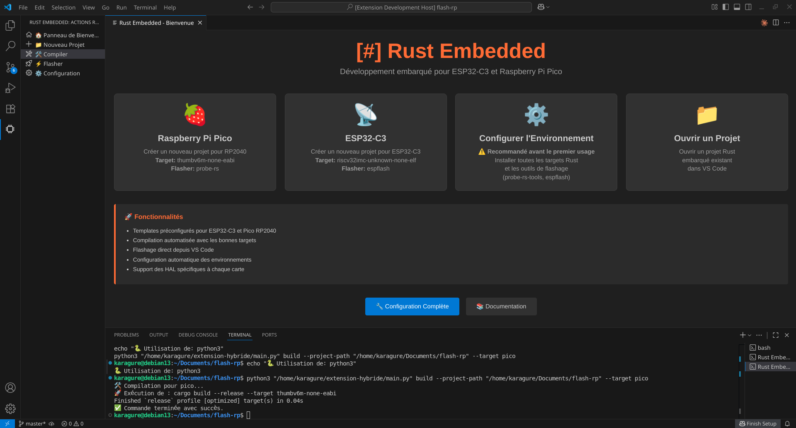

# Extension Rust Embedded pour VS Code

[](https://ko-fi.com/openandhack)

Une extension VS Code hybride TypeScript/Python pour le développement Rust embarqué, spécialement conçue pour les cartes ESP32-C3 et Raspberry Pi Pico (RP2040).



> 🚧 **Extension en développement** : Actuellement en phase de test. Sera publiée sur le VS Code Marketplace après validation complète avec ESP32-C3.

## ✨ Fonctionnalités

- 🚀 **Création de projets** : Templates pré-configurés pour ESP32-C3 et Pico RP2040
- 🛠️ **Compilation automatisée** : Build optimisé pour l'embarqué
- ⚡ **Flashage intelligent** : 
  - **Pico RP2040** : Mode BOOTSEL (UF2) avec fallback automatique + Mode SWD (probe-rs)
  - **ESP32-C3** : Flashage série via espflash
- 🎯 **Gestion des targets** : Installation automatique des targets Rust
- 🔧 **Configuration d'environnement** : Setup complet en un clic
- 📱 **Interface intuitive** : Panel visuel avec sélection de carte
- 🔄 **Fallback robuste** : Convertisseur UF2 personnalisé quand les outils officiels échouent

## Installation

1. Copiez cette extension dans votre dossier d'extensions VS Code
2. Installez les dépendances :
   ```bash
   npm install
   npm run compile
   ```
3. **Lancez l'extension** : Appuyez sur `F5` dans VS Code pour démarrer l'extension en mode développement

## 📋 Prérequis

- **Rust** : Installé via rustup
- **Python 3.x** : Pour le backend de gestion des projets (détection automatique python3/python)
- **Cargo** : Gestionnaire de packages Rust

## 🚀 Utilisation

### 🎯 Workflow ultra-simple (3 étapes)

1. **Lancez** : `F5` dans VS Code → L'onglet **Rust Embedded** apparaît dans la barre latérale
2. **Créez** : Cliquez sur **"Panneau de Bienvenue"** → Cliquez sur une carte (Pico/ESP32-C3) → Nommez votre projet → Terminé !
3. **Développez** : Codez dans `src/main.rs` → Cliquez **🛠️ Compiler** → Cliquez **⚡ Flasher**

> 🎉 **C'est tout !** Votre code Rust tourne sur votre microcontrôleur.

### Configuration initiale automatique

1. **Lancez l'extension** avec `F5` 
2. Dans la barre latérale gauche, l'onglet **Rust Embedded** apparaît automatiquement
3. Cliquez sur **"Configuration"** dans le panel
4. L'extension installera automatiquement :
   - **Targets Rust** : `thumbv6m-none-eabi` (Pico), `riscv32imc-unknown-none-elf` (ESP32-C3)
   - **Outils Pico** : `elf2uf2-rs`, `probe-rs`, `llvm-tools-preview`
   - **Outils ESP32-C3** : `espflash`

### Créer un nouveau projet

**Via l'interface visuelle (Simple et intuitif)** :
1. **Après avoir lancé l'extension** (`F5`), l'onglet **Rust Embedded** apparaît dans la barre latérale gauche
2. Cliquez sur **"Panneau de Bienvenue"** dans le panel
3. **Cliquez directement** sur la carte souhaitée (Pico RP2040 ou ESP32-C3)
4. Saisissez le nom de votre projet dans la boîte de dialogue  
5. Le projet est créé automatiquement avec toutes les configurations optimisées

**Via les commandes** (optionnel) :
1. `Ctrl+Shift+P` → `Rust Embedded: Créer un nouveau projet Rust embarqué`
2. Choisissez votre nom de projet et carte cible

### Compiler et flasher

1. Ouvrez un projet Rust embarqué
2. Dans l'onglet **Rust Embedded** (barre latérale gauche), cliquez simplement sur :
   - **🛠️ Compiler** → Compile automatiquement pour la target détectée
   - **⚡ Flasher** → Flash automatiquement le firmware sur votre carte

> ✨ **Interface 100% visuelle !** Tout se fait en quelques clics dans la barre latérale, aucun raccourci clavier nécessaire.

### 🍓 Flashage Pico RP2040 - Deux modes supportés

**Mode BOOTSEL (Recommandé)** :
1. Débranchez le Pico
2. Maintenez le bouton BOOTSEL enfoncé
3. Rebranchez le Pico (BOOTSEL toujours enfoncé)
4. Relâchez BOOTSEL → Le Pico apparaît comme lecteur USB
5. Cliquez sur **⚡ Flasher** → Fichier UF2 copié automatiquement

**Mode SWD** (avec débogueur SWD connecté) :
1. Connectez votre débogueur SWD au Pico
2. Cliquez sur **⚡ Flasher** → Utilise probe-rs automatiquement

## Structure des projets générés

### Pour Raspberry Pi Pico (RP2040)
```
mon-projet/
├── Cargo.toml          # Dépendances rp-pico, rp2040-hal
├── .cargo/
│   └── config.toml     # Config thumbv6m-none-eabi + elf2uf2-rs runner
├── memory.x            # Layout mémoire RP2040 (BOOT2, FLASH, RAM)
└── src/
    └── main.rs         # Template avec initialisation HAL optimisée
```

### Pour ESP32-C3
```
mon-projet/
├── Cargo.toml          # Dépendances esp32c3-hal, esp-backtrace
├── .cargo/
│   └── config.toml     # Configuration target riscv32imc-unknown-none-elf  
└── src/
    └── main.rs         # Template avec initialisation périphériques
```

## 📋 Commandes disponibles

> 💡 **Interface visuelle recommandée** : Tout est accessible via l'onglet **Rust Embedded** dans la barre latérale gauche. Les commandes `Ctrl+Shift+P` restent disponibles pour ceux qui préfèrent.

- `Rust Embedded: Ouvrir le panel de bienvenue` 🆕
- `Rust Embedded: Créer un nouveau projet Rust embarqué`
- `Rust Embedded: Compiler le projet`
- `Rust Embedded: Flasher le projet`
- `Rust Embedded: Installer les targets Rust`
- `Rust Embedded: Installer les outils de flashage`
- `Rust Embedded: Configurer l'environnement de développement`

## 🎯 Système de Flashage Intelligent

### Pico RP2040 - Approche multi-méthodes
1. **Méthode directe** : `cargo run` avec `elf2uf2-rs` 
2. **Fallback automatique** : Génération `.bin` → Convertisseur UF2 personnalisé
3. **Copie automatique** : Détection du Pico en mode BOOTSEL et copie auto du fichier UF2
4. **Guide utilisateur** : Instructions étape par étape si problème détecté

### ESP32-C3 - Flashage série
- Utilise `espflash` avec configuration automatique
- Détection automatique du port série
- Flash en mode DIO optimisé

## Architecture

- **Frontend TypeScript** : Interface utilisateur VS Code, gestion des commandes
- **Backend Python** : Logique métier, création de projets, compilation, flashage
- **Templates intégrés** : Configurations pré-définies pour chaque carte

## 🎛️ Cartes supportées

| Carte | Target Rust | Outils de flashage | Modes | Statut |
|-------|-------------|-------------------|-------|---------|
| **Raspberry Pi Pico (RP2040)** | `thumbv6m-none-eabi` | `elf2uf2-rs` + `probe-rs` | BOOTSEL/UF2 + SWD | ✅ |
| **ESP32-C3** | `riscv32imc-unknown-none-elf` | `espflash` | Série/USB | ✅ |

## 🔧 Fonctionnalités avancées

- **🔄 Fallback intelligent** : Si `elf2uf2-rs` échoue avec "Unrecognized ABI", utilise automatiquement le convertisseur UF2 personnalisé
- **🔍 Détection automatique** : Détecte le Pico en mode BOOTSEL et copie automatiquement le fichier UF2
- **🛠️ Installation automatique** : `llvm-tools-preview` installé automatiquement pour `cargo objcopy`
- **🎮 Interface visuelle** : Panel de bienvenue avec cartes de sélection intuitive
- **🐍 Multi-plateforme** : Détection automatique `python3` vs `python` selon l'OS

## 🚨 Dépannage

### Problème "Unrecognized ABI" (Pico)
**Cause** : L'outil `elf2uf2-rs` ne reconnaît pas l'ABI du fichier ELF généré
**Solution** : L'extension utilise automatiquement le convertisseur UF2 personnalisé en fallback ✅

### Problème "Could not find tool: objcopy"
**Cause** : Le composant `llvm-tools-preview` n'est pas installé
**Solution** : Lancez `Rust Embedded: Installer les outils de flashage` pour Pico ✅

### Pico non détecté en mode BOOTSEL
**Vérifications** :
1. Le Pico est-il correctement connecté en mode BOOTSEL ?
2. Le lecteur `/media/*/RPI-RP2` est-il monté ?
3. Essayez de débrancher/rebrancher en maintenant BOOTSEL

## 💡 Exemples d'utilisation

### Créer un projet LED clignotante (Pico)
```bash
# Via l'extension ou commande
python3 main.py create --target pico --project-name led-blink
cd led-blink
# Modifiez src/main.rs avec le code ci-dessous
# Flashez via l'extension VS Code
```

### 🍓 Exemple de code : LED clignotante Pico RP2040
Remplacez le contenu de `src/main.rs` par ce code testé et fonctionnel :

```rust
#![no_std]
#![no_main]

// Les traits (interfaces) nécessaires pour contrôler la broche (allumer/éteindre).
use embedded_hal::digital::v2::OutputPin;
use panic_halt as _;
use rp_pico::entry;
use rp_pico::hal::{
    clocks::{init_clocks_and_plls, Clock},
    pac,
    sio::Sio,
    watchdog::Watchdog,
};

#[entry]
fn main() -> ! {
    let mut pac = pac::Peripherals::take().unwrap();
    let core = pac::CorePeripherals::take().unwrap();
    
    let mut watchdog = Watchdog::new(pac.WATCHDOG);
    let clocks = init_clocks_and_plls(
        rp_pico::XOSC_CRYSTAL_FREQ,
        pac.XOSC,
        pac.CLOCKS,
        pac.PLL_SYS,
        pac.PLL_USB,
        &mut pac.RESETS,
        &mut watchdog,
    )
    .ok()
    .unwrap();

    // 1. Initialiser le SIO (Single-cycle I/O) pour accéder aux broches GPIO
    let sio = Sio::new(pac.SIO);

    // 2. Initialiser les broches GPIO
    // Le pilote `rp_pico::Pins` est une manière pratique de toutes les configurer.
    let pins = rp_pico::Pins::new(
        pac.IO_BANK0,
        pac.PADS_BANK0,
        sio.gpio_bank0,
        &mut pac.RESETS,
    );

    // 3. Configurer la broche de la LED (pin 25) en sortie "push-pull"
    // Le pilote nous donne un accès facile à la LED avec `pins.led`
    let mut led_pin = pins.led.into_push_pull_output();

    // 4. Créer un délai en utilisant le timer du cœur (SysTick)
    // On lui donne la fréquence de l'horloge système pour qu'il puisse calculer le temps.
    let mut delay = cortex_m::delay::Delay::new(core.SYST, clocks.system_clock.freq().to_Hz());

    loop {
        // Allumer la LED (mettre la broche à l'état HAUT)
        led_pin.set_high().unwrap();
        // Attendre 500 millisecondes
        delay.delay_ms(500);
        // Éteindre la LED (mettre la broche à l'état BAS)
        led_pin.set_low().unwrap();
        // Attendre 500 millisecondes
        delay.delay_ms(500);
    }
}
```

> ✅ **Code testé et fonctionnel !** Ce code fait clignoter la LED intégrée du Pico RP2040 toutes les 500ms.

**Que fait ce code :**
- 🔧 **Initialise** les horloges et périphériques du RP2040
- 📍 **Configure** la broche GPIO 25 (LED intégrée) en sortie
- ⏱️ **Crée** un timer pour les délais précis
- ♻️ **Boucle** infinie : LED ON → délai 500ms → LED OFF → délai 500ms

**Pour tester :**
1. Créez un nouveau projet Pico via l'extension
2. Remplacez `src/main.rs` par ce code
3. Cliquez **🛠️ Compiler** puis **⚡ Flasher**
4. Votre Pico clignote ! 🎉

### Flashage manuel si nécessaire
```bash
# Le fichier UF2 est généré dans target/thumbv6m-none-eabi/release/
# Copiez-le manuellement vers le Pico en mode BOOTSEL
cp target/thumbv6m-none-eabi/release/mon-projet.uf2 /media/$USER/RPI-RP2/
```

## 🛠️ Développement de l'extension

### Lancement en mode développement
```bash
# Installer les dépendances
npm install
npm run compile

# Lancer l'extension de développement
# Appuyez sur F5 dans VS Code pour démarrer une nouvelle fenêtre avec l'extension active
```

### Tests du backend Python
```bash
# Configuration complète
python3 main.py setup

# Test création de projet
python3 main.py create --target pico --project-name test-pico
python3 main.py create --target esp32c3 --project-name test-esp32

# Test flashage
python3 main.py flash --target pico --project-path test-pico
python3 main.py flash --target esp32c3 --project-path test-esp32
```

### Mode watch pour développement continu
```bash
npm run watch  # Recompile automatiquement à chaque modification
```

## 📝 Notes techniques

- **Convertisseur UF2 personnalisé** : Implémente la spécification UF2 officielle Microsoft
- **Détection multi-plateforme** : Support Linux (`/media/*/RPI-RP2`) et macOS (`/Volumes/RPI-RP2`)  
- **Memory layout optimisé** : Fichier `memory.x` avec sections BOOT2, FLASH, RAM pour RP2040
- **Configuration Cargo** : Runner `elf2uf2-rs` configuré automatiquement pour projets Pico
